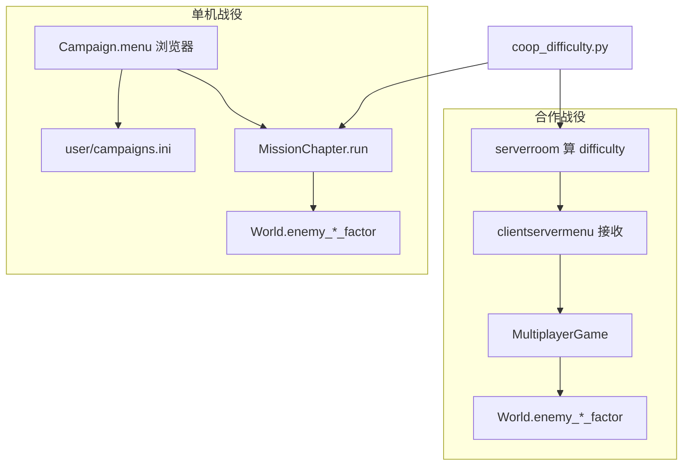

# 战役与合作战役改进说明（1.4.3.9）

本文介绍 SoundRTS **帝国时代决定版风格**的单机战役与合作战役体验：任务浏览器、五档难度、剧情关卡式合作、敌人强度缩放与确定性同步。适用于玩家、战役作者与 Mod 作者。

---

## 1. 概述与设计动机

### 旧方案的局限

- **单机**：战役菜单仅列出已解锁章节，无难度选择、无简介、失败只能退出。
- **合作**（1.4.2.2 起）：服务器可多人同打战役关，但更接近「多人遭遇战」——缺少决定版式的难度、玩家位、同盟 AI 队友与剧情共享语义。

### 新方案（1.4.3.9）

| 维度 | 单机战役 | 合作战役 |
| --- | --- | --- |
| 菜单 | 任务浏览器：简介、难度、已完成/未解锁 | 服务器选战役→章节→**难度**→速度 |
| 难度 | 五档，持久化到 `user/campaigns.ini` | 同左，且随**人类玩家数**再增强敌人 |
| 敌人缩放 | 敌方 hp/输出伤害按百分比缩放 | 服务器算定后广播，旁观/回放一致 |
| 剧情 | 开场 `intro`、关卡目标驱动胜负 | 共享 `intro`、过场与 F9 目标；非「杀光所有敌人」 |
| 玩家位 | 1 人 | 每人类占一位；空位由**同盟 AI** 补满 |

难度数据源：[`soundrts/coop_difficulty.py`](../../../soundrts/coop_difficulty.py)。  
单机菜单：[`soundrts/campaign.py`](../../../soundrts/campaign.py)。  
合作流程：[`soundrts/clientservermenu.py`](../../../soundrts/clientservermenu.py)、[`soundrts/serverroom.py`](../../../soundrts/serverroom.py)。

---

## 2. 单机战役

### 2.1 任务浏览器

主菜单进入战役后，菜单结构如下：

1. **战役简介**（可选）——`campaign.txt` 写了 `synopsis` 时才出现；朗读 TTS 简介后回到列表。
2. **难度：……**——显示当前难度，进入子菜单切换（简单 / 标准 / 中等 / 困难 / 极难）。
3. **继续**——若有进行中的最新章节，快捷进入。
4. **章节列表**——每章标注状态：
   - **已完成**：可重玩，标题正常显示。
   - **当前可玩**：正常标题，可直接进入。
   - **未解锁**：仅显示章节号 +「未解锁」，**不可选**、不播报标题（防剧透）。
5. **返回**。

进度书签保存在 [`user/campaigns.ini`](../../../soundrts/paths.py)（`CAMPAIGNS_CONFIG_PATH`），按战役 ID 记录 `chapter` 与 `difficulty`。

### 2.1.1 英雄成长与跨关继承（规则驱动）

任意战役可在 **`rules.txt`** 配置主角跨章进度，**不限于雷诺**。

**总开关**（写在主角 def 上）：

```text
campaign_carryover 1
```

| 字段 | 默认 | 作用 |
| --- | --- | --- |
| `campaign_carryover_id` | def 名 | 存档键前缀 `hero_<id>_` |
| `campaign_carryover_stats` | `1` | 跨章 **等级+经验** |
| `campaign_carryover_inventory` | `1` | 跨章 **背包** |

子版本（如 `raynor7 is_a … raynor`）共用同一存档键。

- 杀敌获经验；**通关**写入 `user/campaigns.ini`，**失败**不覆盖。
- 下一关开局自动恢复。
- **`campaign.txt`** 可写 `hero_min_level 13:2 16:3 …` 设最低等级。
- **合作战役**不支持跨关继承。

| 需求 | 写法 |
| --- | --- |
| 等级+背包 | 只写 `campaign_carryover 1` |
| 只带经验/等级 | `campaign_carryover_inventory 0` |
| 只带背包 | `campaign_carryover_stats 0` |
| 都不带 | 不写 `campaign_carryover 1` |

剧情信物、结盟仍用 **`campaign_flag`** / **`add_inventory_item`**。  
作者详解：[../developer/战役跨章英雄携带说明.md](../developer/战役跨章英雄携带说明.md)。

### 2.2 战役简介（synopsis）

在战役目录的 `campaign.txt` 中增加一行：

```txt
title 7747
synopsis 7751
```

`7751` 为 `ui/tts.txt`（或 `ui-zh/tts.txt`）中的语音 ID。未写 `synopsis` 则不显示简介项。

示例：[`res/single/The Legend of Raynor/campaign.txt`](../../../res/single/The Legend of Raynor/campaign.txt)。

### 2.3 难度与敌人缩放

- 难度写入 `campaigns.ini` 的 `[战役ID] difficulty = …`，默认 **标准**。
- 开局时 `MissionChapter.run` 把 `enemy_hp_factor` / `enemy_damage_factor` 写入对局；仅缩放**敌方**（非人类且非中立）单位的 **生命**（生成时）与 **输出伤害**（结算时）。
- **标准 + 单人** = 100% / 100%，与改版前关卡平衡一致。
- 单人**不做**「人数乘子」（始终按 1 人计算）。

各档基础百分比（hp / 伤害）：

| 难度 | 敌人生命 | 敌人伤害 |
| --- | --- | --- |
| 简单 | 70% | 70% |
| 标准 | 100% | 100% |
| 中等 | 120% | 115% |
| 困难 | 145% | 135% |
| 极难 | 180% | 165% |

### 2.4 通关与失败

- **胜利**：播报「下一关已解锁」，菜单提供「继续」（下一章）或「退出」；书签自动推进。
- **失败**：菜单提供「**重新挑战本关**」或「退出」。

---

## 3. 合作战役

### 3.1 玩家流程

```mermaid
flowchart LR
    lobby[服务器大厅] --> coop[合作战役]
    coop --> camp[选战役]
    camp --> ch[选章节]
    ch --> diff[选难度]
    diff --> spd[选速度]
    spd --> wait[等人 / 房主开始]
    wait --> intro[全员开场 intro]
    intro --> play[共享目标与过场]
    play --> win{胜利?}
    win -->|是| bookmark[更新房主书签]
    win -->|否| end[结束]
```

1. 服务器大厅 → **合作战役** → 选战役（仅 ``campaign.txt`` 写了 ``coop_campaign 1`` 的战役）→ 选章节 → **难度** → **速度** → 创建房间。
2. **无条约步骤**（合作语义下停战无意义；`treaty` 固定为 0）。
3. 其他玩家加入；房主开始。
4. 全员播放关卡 **intro**（与单机一致），然后按地图**自带触发器**判定胜负。
5. 任意人类完成主要目标即团队胜利；**房主**通关且书签等于当前章时解锁下一章。

### 3.2 战役表与任务地图

- **合作菜单**：由 ``campaign.txt`` 的 ``coop_campaign`` / ``coop_intro`` / ``coop_missions`` 决定显示哪些战役与章节（引擎**不写死**战役名）。
- **加载地图**：合作与单人共用 ``N.txt``；服务端通过 ``ensure_chapter_map`` 加载，不再使用 ``N.coop.txt``。
- 作者说明见 [coop-campaign.md](../developer/coop-campaign.md) 与下文 §4。

### 3.3 剧情关卡 vs 遭遇战

合作战役按**同一张战役地图**运行：

- 胜负由 `add_objective` / `objective_complete` / `defeat` 等触发器决定，**不是**消灭所有玩家电脑。
- `world.is_campaign = True`：战役音乐、触发器电脑播报为「NPC」、不播报电脑「被击败/退出」。
- `cut_scene` 与目标更新对**触发器所属玩家及其全部盟友**广播，人人听到剧情。
- 开局 `MultiplayerGame.pre_run` 播放 `world.intro`。

实现：[`soundrts/game.py`](../../../soundrts/game.py)（`is_coop_campaign`）、[`soundrts/worldplayerbase/triggers.py`](../../../soundrts/worldplayerbase/triggers.py)（`lang_cut_scene`）。

### 3.4 玩家位与同盟 AI 队友

地图声明合作槽位（示例：[`res/single/The Legend of Raynor/1.txt`](../../../res/single/The Legend of Raynor/1.txt)）：

```txt
nb_players_min 1
nb_players_max 2
player_start 1 a1 raynor footman footman
player_start 2 h8 raynor2 footman archer
computer_only e5 ...
```

| 字段 | 含义 |
| --- | --- |
| `nb_players_max` | 合作玩家位数量 |
| `nb_players_min 1` | 允许单人开房；空位由 AI 补满 |
| `player_start N …` | 第 N 位玩家的出生格与初始单位 |
| `computer_only` | 关卡敌人（`populate_map` 归入 `"ai"` 同盟，与人类队敌对） |

服务器 [`Game._fill_coop_ai_partners`](../../../soundrts/serverroom.py) 用 **aggressive** 级同盟 AI 补满空位；人类 + AI 队友开局 **alliance 1**。  
触发器里的 `player1`、`player2` 按加入顺序映射人类；AI 队友位通常不参与剧情触发器，仅协同作战。

### 3.5 难度与人数缩放

合作难度在**基础五档**上再乘**人数乘子**：

```
人数乘子 = 100 + (人类数 - 1) × 20   （单人 = 100%）
最终 hp%  = 基础 hp% × 人数乘子 // 100
最终伤害% = 基础伤害% × 人数乘子 // 100
```

例：**困难** + **3 名人类**：基础 145/135，乘子 140 → 敌人约 **203% hp / 189% 伤害**。

服务器在 `start_game` **之前**下发 `coop_difficulty` 行；客户端写入 `game.enemy_*_factor`。全程**整数**运算，保证 lockstep 一致。回放 seed 行可选追加 `hp% damage%`（旧回放缺省为 100）。

### 3.6 地名与战役资源

地图逻辑名 `战役名/章节号`（如 `The Legend of Raynor/2`）时：

- 客户端自动 [`apply_campaign_from_map_name`](../../../soundrts/lib/resource.py) 加载该战役的 `rules.txt`、`ui/tts.txt` 等。
- 方格播报走 `localize_voice_msg`，`loc_ch02_*` 等地名键解析为 TTS 译文，而非读原文键名。

### 3.7 跨章 campaign_flag

合作对局**不设置** `world.campaign`，因此触发器 `campaign_flag` 读到 `None` 时返回 **False**（确定性 no-op），避免各客户端读本地 `campaigns.ini` 不同步。  
关卡内 `set_map_flag` / `map_flag` 仍用世界内状态，可正常使用。

---

## 4. 地图作者要点

### 4.1 战役表（campaign.txt）

帝国时代决定版式合作在 **`campaign.txt`** 中声明，**不要**再维护平行的 `N.coop.txt`。
单人与合作加载同一份 `N.txt` 任务地图。

```txt
title 7747
synopsis 7751
coop_campaign 1
coop_intro 0
coop_missions 1-29
```

| 字段 | 含义 |
| --- | --- |
| `coop_campaign` | `1` — 出现在服务器「合作战役」菜单 |
| `coop_intro` | 合作流程中的过场章节号（如序章 `0`） |
| `coop_missions` | 可合作的任务章节（支持 `1-29` 或空格列表） |
| `hero_min_level` | 可选；跨章英雄最低等级，如 `13:2 16:3` |

跨章英雄字段说明见 [战役跨章英雄携带说明.md](../developer/战役跨章英雄携带说明.md)。

### 4.1.1 跨章英雄（rules.txt）

主角 def 加 `campaign_carryover 1`；用 `campaign_carryover_stats` / `campaign_carryover_inventory` 控制是否携带等级与背包。详见 [战役跨章英雄携带说明.md](../developer/战役跨章英雄携带说明.md)。

### 4.2 合作地图字段（N.txt）

1. `nb_players_min 1` / `nb_players_max 2` 与多个 `player` 出生块（或 `player_start`）。
2. 为每位合作玩家复制关键触发器（如 `add_objective`、`objective_complete`），或按设计只驱动 `player1` 若目标全局共享。
3. 开局 `trigger playerN (timer 0) (alliance 1)`；敌人 `computer_only` + `trigger computers (timer 0) (alliance 2)`（若地图需要显式同盟）。
4. 可选 `intro`、`cut_scene`；敌人强度由引擎按难度缩放，**不必**在地图里手调数值。

单人战役仍只注册 1 名玩家，仅占用第一个出生点；空位不会在单机中生成合作 AI。

### 4.3 与 1.4.3.0 战役修复的配合

- 多电脑关卡完成任务即可胜利（`Player.victory` 遍历玩家快照，不因 `defeat` 删列表而跳过电脑）。
- 战役内 **F12** 不选结盟目标；触发器电脑统一播报「NPC」。

---

## 5. 架构示意



---

## 6. 与旧版差异

| 旧行为 | 新行为 |
| --- | --- |
| 战役菜单仅章节列表 | 简介 + 难度 + 已完成/未解锁 + 重试 |
| 合作无难度、可能有条约步骤 | 五档难度 + 人数缩放；无条约 |
| 合作像多人 skirmish | 剧情 intro/过场/目标共享；AI 队友补位 |
| 靠 ``N.coop.txt`` 或地图文件推断合作 | ``campaign.txt`` 声明 + 共用 ``N.txt`` |
| 合作地图名可能读 `loc_*` 原文 | 自动加载战役 TTS，本地化地名 |
| 标准难度即原关卡数值 | 仍为 100%/100%；其它档按表缩放 |

---

## 7. 测试

```bash
python -m pytest soundrts/tests/test_changelog_1429_coop_campaign_difficulty.py -q
python -m pytest soundrts/tests/test_changelog_1429b_campaign_browser_difficulty.py -q
python -m pytest soundrts/tests/test_changelog_1429c_coop_story_mission.py -q
python -m pytest soundrts/tests/test_changelog_1429d_coop_player_slots.py -q
python -m pytest soundrts/tests/test_coop_campaign_place_names.py -q
python -m pytest soundrts/tests/test_coop_chapter_maps.py -q
python -m pytest soundrts/tests/test_changelog_1428_campaign_victory_f12.py -q
```

---

## 8. 相关文档与源文件

| 文档 | 说明 |
| --- | --- |
| [渐进式战役目标说明.md](渐进式战役目标说明.md) | `register_objective` 分步目标 |
| [战役密信与结盟说明.md](战役密信与结盟说明.md) | The Legend of Raynor 24–27 章 |
| `doc_src/src/zh/mapmaking.rst` | 任务语法、合作战役段落 |
| [coop-campaign.md](../developer/coop-campaign.md) | 合作战役速查（campaign.txt + N.txt） |

| 源文件 | 职责 |
| --- | --- |
| `soundrts/campaign.py` | 单机浏览器、合作元数据（``coop_*``）、书签、难度 |
| `soundrts/coop_difficulty.py` | 难度表与人数乘子 |
| `soundrts/clientservermenu.py` | 合作菜单、`srv_coop_difficulty` |
| `soundrts/serverroom.py` | AI 队友补位、算定并下发难度 |
| `soundrts/game.py` | `is_coop_campaign`、`intro`、书签更新 |
| `soundrts/worldunit/worldcreature.py` | 敌方 hp 缩放 |
| `soundrts/combat/damage_effects.py` | 敌方输出伤害缩放 |
| `soundrts/lib/resource.py` | 战役资源层、地名 TTS |
